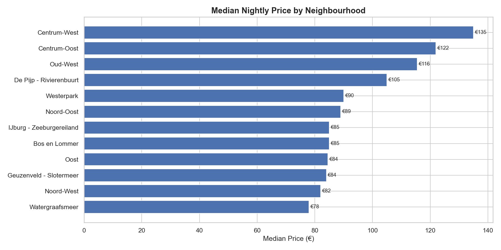
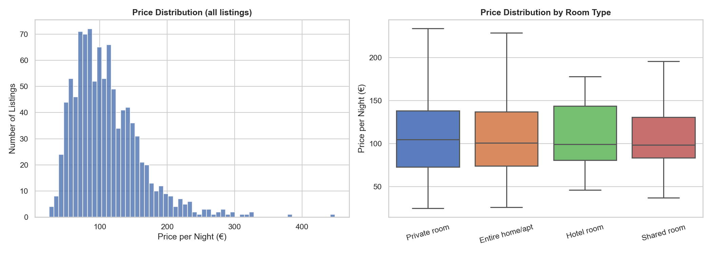
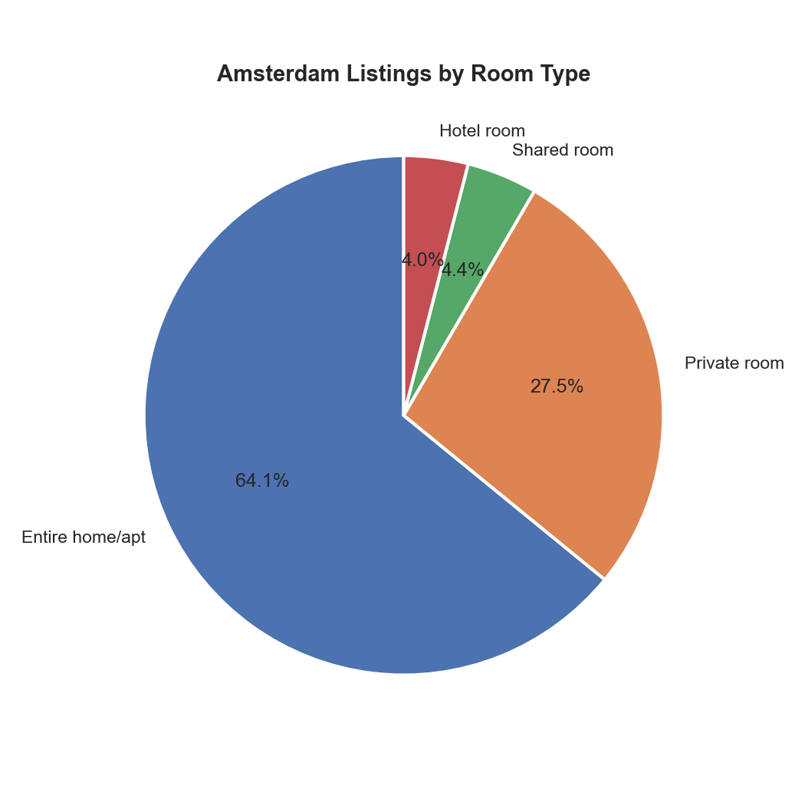
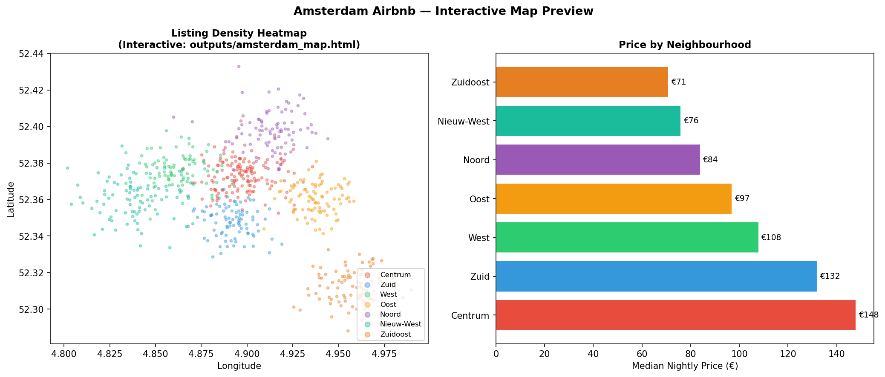

# Amsterdam Open Data Analytics
[](https://python.org)
[](http://insideairbnb.com/amsterdam/)
[](sql/amsterdam_queries.sql)
[](outputs/amsterdam_map.html)

## Business Question

> *Which Amsterdam neighbourhoods face the highest short-term rental pressure, how does pricing vary across the city, and what patterns emerge in host behaviour and seasonal demand?*

This project analyses Amsterdam's open Airbnb dataset to deliver insights relevant to housing policy, hospitality planning, and urban analytics — framed as a business analysis for a local stakeholder.

## Dataset

| Source | Dataset | Licence |
|--------|---------|---------|
| [Inside Airbnb](http://insideairbnb.com/amsterdam/) | listings.csv, reviews.csv, neighbourhoods.geojson | CC0 public domain |
| [data.amsterdam.nl](https://data.amsterdam.nl) | Neighbourhood boundaries, population data | CC0 |

**No API key required.** Synthetic fallback activates automatically if data files are absent.

## Key Outputs







### Interactive Map

> GitHub cannot render HTML files directly. Download and open in your browser, or view the static preview below.



The interactive Folium heatmap ([`outputs/amsterdam_map.html`](outputs/amsterdam_map.html)) shows listing density across Amsterdam neighbourhoods — download and open in any browser to explore.

## Analysis Modules

| Module | What it does |
|--------|-------------|
| `amsterdam_analysis.py` | Loads data, computes KPIs, generates charts + interactive Folium heatmap |
| `sql/amsterdam_queries.sql` | 8 SQL queries: rental density, price bands, host concentration, seasonal demand |

## SQL Queries Included

| Query | Technique |
|-------|-----------|
| Rental density by neighbourhood | JOIN + density calculation |
| Price bands (percentiles) | `PERCENTILE_CONT` window function |
| Room type breakdown | Partition-level proportion |
| Commercial vs occasional listings | Conditional aggregation |
| Review-based occupancy proxy | Date-filtered LEFT JOIN |
| Host concentration (multi-listing) | CTE + CASE segmentation |
| Seasonal demand patterns | `EXTRACT(MONTH)` aggregation |
| Price premium by distance to centre | Distance band classification |

## Quickstart

```bash
git clone https://github.com/Shreya-Macherla/Amsterdam-Open-Data-Analytics
cd Amsterdam-Open-Data-Analytics
pip install -r requirements.txt
python amsterdam_analysis.py
# → outputs/price_by_neighbourhood.png
# → outputs/room_type_mix.png
# → outputs/amsterdam_map.html  (download and open in browser)
```

To use the real dataset: download from [Inside Airbnb](http://insideairbnb.com/get-the-data/) → Amsterdam → `listings.csv.gz` and place in `data/`.

## Repository Structure

```
Amsterdam-Open-Data-Analytics/
├── amsterdam_analysis.py          # Main analysis + Folium map generation
├── sql/
│   └── amsterdam_queries.sql      # 8 SQL queries for deeper analysis
├── data/                          # Place downloaded CSVs here (gitignored)
├── outputs/
│   ├── price_by_neighbourhood.png
│   ├── price_distribution.png
│   ├── room_type_mix.png
│   ├── amsterdam_map_preview.png  # Static map preview
│   └── amsterdam_map.html         # Interactive Folium heatmap (open in browser)
├── requirements.txt
└── README.md
```

## Tools

`Python 3.8` `Pandas` `GeoPandas` `Folium` `Matplotlib` `Seaborn` `SQL (DuckDB)`

---

*Data sourced from [Inside Airbnb](http://insideairbnb.com/amsterdam/) under CC0 licence.*
